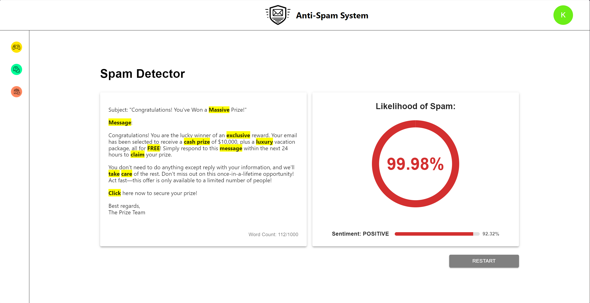

<!-- TABLE OF CONTENTS -->

<details>

  <summary>Table of Contents</summary>

  <ol>

    <li>

      <a href="#about-the-project">About The Project</a>

      <ul>

        <li><a href="#built-with">Built With</a></li>

      </ul>

    </li>

    <li>

      <a href="#getting-started">Getting Started</a>

      <ul>

        <li><a href="#installation">Installation</a></li>

      </ul>

    </li>

    <li><a href="#usage">Documentation</a></li>

  </ol>

</details>

  
  
  

<!-- ABOUT THE PROJECT -->

## About The Project

  



In this context the Anti-Spam System project’s goal has to do with discriminating in an efficient manner against the emerging problem in the sphere of spam email. By implementing machine learning algorithms such as natural language processing together with Artificial intelligence, the AS system will accurately identify spam information flow and block unnecessary messages for the users which in turn will be useful for creation of a healthy and safe social platform for the end users.
  

<p align="right">(<a href="#readme-top">back to top</a>)</p>

  
  
  

### Built With


* [![React][React.js]][React-url]
*  [![MUI][MUI]][MUI-url]
*  [![Axios][Axios]][Axios-url]
*  [![MobX][MobX]][MobX-url]
*  [![Grammy][Grammy.js]][Grammy-url]
* [![PyTorch][PyTorch]][PyTorch-url] 
* [![Temporal][Temporal]][Temporal-url] 
* [![HuggingFace][HuggingFace]][HuggingFace-url]
* [![Tesseract][Tesseract]][Tesseract-url]
* [![Flask][Flask]][Flask-url]


  

<p align="right">(<a href="#readme-top">back to top</a>)</p>

  


## Getting Started

  
In this section the way of running project locally will be shown, it is suggested to follow steps. As well it should be noted, that building of the project can take more time as expected, since some libraries are large. 
  

### Installation

1. Clone the repo

```sh
git clone https://github.com/sqdArtemy/anti-spam-system
```

2. Compose the docker file

```sh

docker compose -f .\devops\docker-compose.yaml up --build

```

## Documentation

Documentation for this project was made using SRS and SwDD documents, In order to see it, follow the following links: 
- [SRS][srs-url]
- [SwDD][swdd-url]

## Authors
| Full Name           | Email                     |
| ------------------- | ------------------------- |
| Artyom Tashyan      | sqd.artemy@gmail.com      |
| Ravshan Ubaydullaev | ravshanltd@gmail.com      |
| Saidjon Khadar-Zade | saidjonzade06@gmail.com   |
| Farrukh Utkurov     | farrukh.utkurov@gmail.com |
| Komiljon Yuldashev  | komilzonu5@gmail.com      |
| Pavel Tin           | tinpavel6@gmail.com       |


<p align="right">(<a href="#readme-top">back to top</a>)</p>

<!-- MARKDOWN LINKS & IMAGES -->

[Grammy.js]: https://img.shields.io/badge/grammY-2D8CFF?style=for-the-badge&logo=telegram&logoColor=white

[Grammy-url]: https://grammy.dev/

[React.js]: https://img.shields.io/badge/React-20232A?style=for-the-badge&logo=react&logoColor=61DAFB

[React-url]: https://reactjs.org/

[MUI]: https://img.shields.io/badge/MUI-007FFF?style=for-the-badge&logo=mui&logoColor=white

[MUI-url]: https://mui.com/

[Axios]: https://img.shields.io/badge/Axios-5A29E4?style=for-the-badge&logo=axios&logoColor=white

[Axios-url]: https://axios-http.com/docs/intro

[MobX]: https://img.shields.io/badge/MobX-FF9955?style=for-the-badge&logo=mobx&logoColor=black

[MobX-url]: https://mobx.js.org/README.html

[PyTorch]: https://img.shields.io/badge/PyTorch-EE4C2C?style=for-the-badge&logo=pytorch&logoColor=white 

[PyTorch-url]: https://pytorch.org/ 

[Temporal]: https://img.shields.io/badge/Temporal-000000?style=for-the-badge&logo=temporal&logoColor=white 

[Temporal-url]: https://temporal.io/ 

[HuggingFace]: https://img.shields.io/badge/HuggingFace-FFCC00?style=for-the-badge&logo=huggingface&logoColor=black 

[HuggingFace-url]: https://huggingface.co/ 

[Tesseract]: https://img.shields.io/badge/Tesseract-5E96F5?style=for-the-badge&logo=tesseract&logoColor=white 

[Tesseract-url]: https://github.com/tesseract-ocr/tesseract

[Flask]: https://img.shields.io/badge/Flask-000000?style=for-the-badge&logo=flask&logoColor=white 

[Flask-url]: https://flask.palletsprojects.com/

[srs-url]: https://docs.google.com/document/d/10vubRMWKLkfK_Gbb1n2WyPEX8yFTIchvfts0EZaYdNM/edit?usp=sharing

[swdd-url]: https://docs.google.com/document/d/1NCpSpQkOM21Adf77qvSCmvChngSVxlG5nx14-c_WI48/edit?usp=sharing